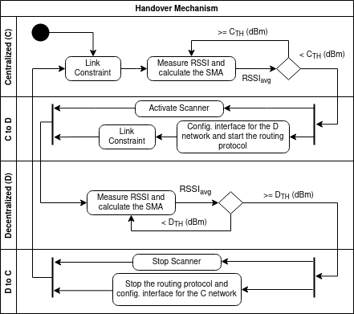

# Availability in SDTN


This is an experiment addressing availability issues in Software-Defined Tactical Networks (SDTN).
The availability of services in those networks can be affected by disruptive network scenarios that can be caused by interference, barriers or the mobility of nodes.

We developed an approach to reduce the probability that such situations of unavailability occur.
To test our approach we used Mininet-Wifi to emulate a wireless network and simulate a mobility scenario.
This scenario includes two nodes (1, 2) with wireless interfaces and an command post (CP) that is a SDN switch and has a wired link to a SDN controller.
The scenario also includes a permanent data flow from node 1 to node 2.
At first, the nodes 1 and 2 are connected to the SDN controller through the command post.
Then the nodes are being disrupted from it.
This also disrupts the data flow between them because the two nodes have no connection to each other anymore.

Through mobility models, we created trace files that dictate the node's mobility patterns.
Moreover, by transforming the mobility patterns into network states [TNT](https://doi.org/10.36227/techrxiv.14141501.v1), we used the discrete states to change the Linux Queue Discipline (qdisc),  
responsible  to  create  the  respective  link  constraints (bandwidth and delay), in order to simulate the link behavior in tactical networks, 
such as High Frequency (HF), Ultra High Frequency (UHF), Very High Frequency (VHF), and Satellite Communications (SatCom). 
Here we provide exemplars of UHF nodes moving following a  [Pendulum](data/img/Trace_Pendulum_Filled_Shortest_NtoBS_UHF.pdf) and [Gauss Markov](data/img/Trace_GaussMarkov2_NtoBS_UHF.pdf) patterns.

The central part of the approach towards improving the availability in this scenario is a script that can be run in each of the data forwarding nodes.
The script enables the nodes to switch their wireless interfaces from managed mode to ad-hoc mode whenever they are disrupted from the infrastructure.
In ad-hoc mode the nodes use OLSR to establish a communication channel to prevent the data flow from being disrupted.

In this version there are two different approaches implemented for the script that decides when to switch between managed to ad-hoc mode.
The first version is based on the mobile node(s) monitoring the RSSI of the CP that has to be connected for the managed network mode.
The RSSI based approach is a stand-alone experiment and can be used directly.
The second version uses mobility predictions for the mobile nodes to decide ahead of time when a disruption of the CP connection will occur.
This approach is designed to be used together with [https://github.com/prettore/CAMS](https://github.com/prettore/CAMS), i.e., as input for this experiment the resulting output files from CAMS can be used.
How to use the two experiments is explained in two separate subsections [here (RSSI)](#rssi-based-approach) and [here (mobility prediction)](#mobility-prediction-based-approach).
Before using it we recommend reading [the setup instructions](#getting-started) which apply to both experiments.

## Virtual Presentation

[](https://youtu.be/o5MBS2nbPUA)


## Getting Started
The experiment is based on the Mininet-Wifi framework.
We recommend the usage of the Mininet-Wifi VM to test this experimental setup.

You can find the download link for the VM and the instructions how to use it in the Mininet-Wifi [Github repository](https://github.com/intrig-unicamp/mininet-wifi#pre-configured-virtual-machine).
Since our project uses OLSR as a central element of the approach you need to make sure that your version of Mininet-Wifi or the version that is pre-installed on the VM has OLSR installed.
Otherwise, please install OLSR or re-install Mininet-Wifi with the OLSR option selected for the installation.
You can also find instructions for that in the documentation of Mininet-Wifi.

If you have not used the scripts of this project before we recommend reading the following sections.
There, you will find important information about how to set everything up initially.

_**Note:** Additional important information for the usage of this project can be found in the comments of the python scripts, especially in the files `experiment_*.py` and `flexible_sdn_*.py`.
We strongly recommend looking into the code of those files before using them._

### Dependencies
This project has been written in Python and needs Python 3.7 or higher.
Besides the Mininet-Wifi framework the experiment requires the following Python libraries:

 - numpy
 - pandas
 - matplotlib
 - pyshark

Additionally, Mininet-Wifi has to be modified for this experiment to work properly.
The modification is explained in detail in the next [section](#how-to-modify-mininet-wifi-to-work-with-this-experiment) 
The further usage of this experiment is explained after that in the section: [How to use the experiment setup](#how-to-use-the-experiment-setup)

Furthermore, the experiment uses `D-ITG` to generate a data flow.
Documentation and installation instructions can be found here:
[http://traffic.comics.unina.it/software/ITG/index.php](http://traffic.comics.unina.it/software/ITG/index.php)

```shell
install d-itg: $ sudo apt install d-itg
```

```shell
git clone https://github.com/KimiNewt/pyshark.git
cd pyshark/src
python setup.py install
```

### How to modify Mininet-Wifi to work with this experiment
_**Note:** If you don't care about the explanation why this modification is necessary and just want to know how to apply it then you can jump to [How to apply the modification](#how-to-apply-the-modification)._

Mininet-Wifi includes a feature that conflicts with our approach.
The framework has a mechanism implemented to automize handovers and reconnections to access points when a mobility pattern is replayed.
This can cause distortions in the result of our experiment because the framework does not recognize when we let a node switch from managed mode to ad-hoc mode manually.
If the node disconnects from an access point and switches to ad-hoc mode during the experiment the framework will automatically search for access points in range and try to reconnect to them.
This blocks the primary network interface which should be used for the data flow in our experiment.
The data flow will then be disrupted due to the framework executing the automated reconnection trials.

In our experiment the disconnections from access points as well as reconnections and handovers are central part of the approach.
We want to be able to precisely control when disconnections, reconnections or handovers will be executed, so we have to deactivate this feature.
Sadly, this is not possible without manipulating the code of Mininet-Wifi.
Initializing the Mininet-Wifi with the options `autoAssociation=False, allAutoAssociation=False` did not fix this problem although the documentation made us believe that it should (Maybe this is a bug? :thinking:).


#### How to apply the Modification
For the fix you just need to comment out one line where the function is called that causes the disturbance.
The line that has to be removed or commented out can be found under the following link:

[https://github.com/intrig-unicamp/mininet-wifi/blob/d94975f9aebba1805d403a4a1be25867cf147aef/mn_wifi/replaying.py#L80](https://github.com/intrig-unicamp/mininet-wifi/blob/d94975f9aebba1805d403a4a1be25867cf147aef/mn_wifi/replaying.py#L80)

It is inside the function `mn_wifi.replaying.ReplayingMobility.mobility`

To fix the above mentioned issue just comment out the line `ConfigMobLinks()` in the same way as in the following example:
```python
class ReplayingMobility(Mobility):
    ...

    def mobility(self, nodes):
        ...
        
        while self.thread_._keep_alive:
            time_ = time() - currentTime
            if len(nodes) == 0:
                break
            for node in nodes:
                if hasattr(node, 'p'):
                    calc_pos(node, time_)
                    if len(node.p) == 0:
                        nodes.remove(node)
                    # ConfigMobLinks()
                    if self.net.draw:
                        node.update_2d()
            if self.net.draw:
                PlotGraph.pause()
```

After that re-install the modified Mininet-Wifi using the original installation script.
Without the re-installation the fix will not be applied to the version which is used by python.

```shell
re-install Mininet-Wifi: $ cd mininet-wifi
re-install Mininet-Wifi: $ sudo util/install.sh -Wlnfv
OLSR: $ sudo util/install.sh -O
```

To undo this modification just undo the comment in the mentioned line and reinstall Mininet-Wifi again.

## Issue?

If you have experienced any issue to modify the mininet-wifi, or you experienced a different behavior noticed in the paper [Reference](#How to cite), 
replace the mininet-wifi folder with the one we provided [mininet-wifi](doc/mininet-wifi.zip).

```shell
Rename the current folder (like 'mininet-wifi' -> 'mininet-wifi_old')
copy our mininet-wifi at the same folder
execute the steps above (re-install Mininet-Wifi)
```

## How to use the experiment setup
We assume that you have completed the following steps at this point:

 - Modified Mininet-Wifi to prevent it from disturbing the experiment
 - Installed the modified version of Mininet-Wifi (preferably in the Mininet-Wifi VM)
 - Installed OLSR
 - Installed all required Python libraries
 - Installed D-ITG

If you did not complete all of the above setup steps then please refer to the previous section: [Setup](#Dependencies).
If you have set everything up then you can continue with the next steps.

In the standard configuration the experiment needs a remote SDN controller to be available under the Address 

### RSSI based approach
To start the experiment with the default values set for the variables you can just execute the included script `experiment_rssi.py` like this:

```shell
sudo python ./experiment_rssi.py
```

To get an explanation of the available options and flags and their default values of the CLI just use:

```shell
python ./experiment_rssi.py --help

usage: experiment_main.py [-h] [-m MOBILITYSCENARIO] [-s SCANINTERVAL]
                          [-d DISCONNECTTHRESHOLD]
                          [-r RECONNECTTHRESHOLD] [-S] [-w SIGNALWINDOW]
                          [-O] [-b BUFFERSIZE] [-auto]

Tactical network experiment!

optional arguments:
  -h, --help            show this help message and exit
  -m MOBILITYSCENARIO, --mobilityScenario MOBILITYSCENARIO
                        Select a mobility scenario (Integer: 1, 2 or 3)
                        (default: 1) where 1: Pendulum (UHF), 2:
                        GaussMarkov (UHF), 3: ManhattanGrid (UHF)
  -s SCANINTERVAL, --scanInterval SCANINTERVAL
                        Time interval in seconds (float) for scanning if
                        the wifi CP is in range while being in adhoc mode
                        (default: 2.0)
  -d DISCONNECTTHRESHOLD, --disconnectThreshold DISCONNECTTHRESHOLD
                        Signal strength (float) below which station
                        dissconnects from CP and activates OLSR (default:
                        -87.0 dBm)
  -r RECONNECTTHRESHOLD, --reconnectThreshold RECONNECTTHRESHOLD
                        Minimal signal strength (float) of CP required
                        for trying reconnect (default: -82.0 dBm)
  -S, --scanInterface   Use a second interface for scanning to prevent
                        blocking the primary interface and thus
                        disrupting the data flow (default: True)
  -w SIGNALWINDOW, --signalWindow SIGNALWINDOW
                        Window for the moving average calculation of the
                        CP signal strength (default: 10)
  -O, --noOlsr          Set to disable the usage of olsr when connection
                        to CP is lost (default: False)
  -b BUFFERSIZE, --bufferSize BUFFERSIZE
                        Set the node buffer size (default: 100 packets)
  -auto, --auto         Automatically stop the experiment after the
                        buffer is empty
```
 
#### Structure
The script `experiment_rssi.py` initializes the experiment with a Mininet-Wifi topology.
The script `flexible_sdn_rssi.py` is run in the nodes of that topology and contains the actual approach of this project.
After running the experiment the main script directly executes evaluation scripts which produce statistic summaries and plots.
Statistics and plots of each run are saved in a new directory under `./data/statistics/`.
The directory will be named with the date and time of the start of the experiment.

The mobility patterns can be found in CSV files under `./data/`.
The mobility patterns that can be used through the CLI of `experiment_rssi.py` are in the files `Scenario_*.csv`

The scripts `eval_ditg.py` and `eval_statistics.py` are used to evaluate the statistics after running the experiment.
The output of those are needed to plot the results with `plot_statistics.py`.

`scanner.py` contains the Multiprocessing class that is used inside the nodes to scan for the AP.
`cmd_utils.py` contains some wrapper functions for the shell commands of `iw dev`.
`sta1-wlan0-olsrd.conf` and `sta3-wlan0-olsrd.conf` contain the configurations needed to start OLSRd. 

#### Design
The approach that we implemented in `flexible_sdn_rssi.py` is designed as follows:

The basic idea behind our solution is that devices follow SDN policies as long as they are connected to the SDN infrastructure including a controller and a Command Post (CP) connecting the controller with the other nodes and the nodes among each other. 
If this infrastructure is not available to the nodes because of a link disconnection they switch to using a MANET avoiding disruptions of data flows. 
Switching betweenSDN and MANET is managed by a control mechanism which can be run in the nodes of a SDTN and thereby control the network interfaces of the respective node.

Our solution is inspired by the concept of using decentralized (D) control as a backup in case of unavailability of centralized (C) infrastructure. 
The decentralized control D is represented by a MANET routing protocol and the SDN infrastructure represents the centralized control C, although it is not limited to these examples. 
Moreover, we assume that the tactical nodes follow SDN policies as long as they are connected to the SDTN infrastructure, including controllers and SDN-capable CP. 
If, due to link disconnections, the SDTN infrastructure is unavailable (SDN-capable CP) the nodes switch to use a MANET protocol, mitigating disruptions of data flows and keep the military operation going at the tactical edge.



The  process  to  switch  between  centralized  control C (using  a  SDN  controller)  and  decentralized  control D (using  a MANET) is managed by a handover mechanism deployed to the SDTN nodes. 
Thereby, the handover mechanism controls the  network  interfaces  activating  a  MANET  routing  protocol whenever  the  signal  reaches  a  predefined  connectivity  limit with the SDN-capable CP and controller. 
The activity diagram shown  in  the above Figure  illustrates  the  flow  of  states  within  the handover mechanism. The state of a node is organized in four horizontal lanes as follows, the node can either be connected to C; 
switch from C to D; be connected to D; or switch from D to C. It is assumed that the node is connected to the CP and orchestrated by a SDN controller in the beginning. 
Therefore, the  start  point  is  located  in  the  top  lane  where  the  node  is connected to the SDN infrastructure, although the activity flow is a loop and could start in any of the two connected states.

To  detect  a  disruption  of  the  node  fromC,  the  handover mechanism  monitors  a  set  of  performance  metrics  defining the  network  state.
Assuming  that  the  connection  to C is given  by  wireless  links  to  the  CP,  the  mechanism  monitors the  Received  Signal  Strength  Indicator  (RSSI)  of  the  CP  to identify  a  disruption  from  the  SDN  infrastructure.
At  the connected C state,  the  queuing  discipline  creating  the  link constraints and reducing packet loss together with the control mechanism  monitoring  the  signal  are  both  at  the  top  lane  of the activity diagram.

The  RSSI,  between  the  mobile  node  and  the  CP,  is  monitored  by  a  process  taking  measurements  every RSSI_scan seconds  and  calculating  a  Simple  Moving  Average  (SMA) RSSI_avg within a given time window W_SMA = n. 
The moving  average  is  used  to  reduce  the  noise  in  the  measurements because  the  raw  values  are  the  result  of  a  stochastic  process with a significant variance that disturbs the control mechanism. 
In  sequence,  the RSSI_avg is  compared  to  a  threshold  value C_TH which   is  the   minimum   signal  strength   expected  to provide a reliable connection for centralized control C. 
Then the  control  mechanism  can  switch  from C to D (SDN  to MANET) when the averaged signal is too weak to be reliable RSSI_avg < C_TH. 
Otherwise, RSSI_avg ≥ C_TH the nodes are still  connected  to C.  Notice  that  the  definition  of  the  signal threshold,  between  reliable  and  unreliable,  depends  on  the wireless technology, such as HF, VHF, UHF, SatCom or WI-FI and the noise levels in the propagation medium. 
Thus, the C_TH should be set depending on the type of communication technology. Moreover, the scan interval RSSI_scan is defined in  seconds,  and  increasing  the  scanning  time  will  reduce  the mechanism  responsiveness  over  the  topology  changes  and vice-versa.

For  switching  the  network  from C to D the  node  enters a  handover  state  depicted  in  the  second  lane  of  the  activity diagram.  
During  the  handover,  the  node  activates  a  scanner, re-configures its network interface to disconnect from the CP and  activate  a  fully  distributed  routing  protocol  used  in D. 
At  this  point,  any  protocol  designed  for  MANETs  such  as BATMAN,  OLSR,  and  BABEL  can  be  used.  
The  scanner  is needed  to  monitor  the  signal  strength  of  the  CP  to  decide when  to  switch  back  to C when  the  node  is  under  the decentralized network D. 
After that, the topology changes due to the new communication radius between the nodes, and the link  constraint  mechanism  is  called  again  according  to  the waveforms, resulting in different link data rates (bandwidth).

The scanner activated during the handover is used over the D connection  shown  in  the  third  lane  of  the  diagram.  
Since the  node  has  no  active  connection  to  the  CP,  in  this  state the signal strength can not be monitored as simple as before. 
Therefore, the control mechanism has to scan actively for the Service  Set  Identifier  (SSID)  of  the  CP  to  get  measurements of the signal strength. 
This is done by the scanner on a second wireless network interface, because active scanning blocks the interface, thereby causing packet loss if it is executed on the primary interface.

When the node is connected to D the active scanner periodically triggers scans for the CP on the second interface. 
In this state, the control mechanism continues to take measurements of  the  signal  strength  every RSSI_scan seconds,  calculating the W_SMA based on n measurements. 
The RSSI_avg is then used by the control mechanism to decide when to switch the network. 
To  do  so, D_TH threshold  is  used  as  a  minimum signal  strength  that  is  considered  strong  enough  for  a  reliable  connection  to  the  CP.  Notice  that,  to  avoid  a  loop  of handovers  between  the  two  networks  the  thresholds  must  be D_TH > C_TH.

When RSSI_avg ≥ D_TH, the control mechanism enters the handover state, bottom lane of the diagram, switching from D to C. 
Otherwise, RSSI_avg < D_TH, the nodes keep connected to a fully distributed network D. 
Having reached the first case,the handover starts, the scanner is deactivated, and in parallel,the  network  interface  is  reconfigured  to  disconnect  from D and  connect  to  the  CP. 
Before  the  connection  to C,  the  dataflow  is  shaped  by  the  link  constraint  mechanism  using  qdisc to control the packet delivery rate reducing packet loss during the handover. 
Therefore, based on this approach any changes caused by the mobility of the nodes can now benefit from both types of networks mitigating packet loss.

The major steps of our handover solution are summarized as follows: i) The control mechanism monitors the connection to the CP and switches from a centralized network C to a decentralized  network D by  re-configuring  the  wireless  interfaces. 
It scans for the SSID of the CP during the ad-hoc connection to  detect  when  switching  back  from D to C is  possible. 
ii) Instead of switching the network when the connection to the CP is lost completely, the connection monitor can measure the signal strength and uses thresholds to determine if the signal is  strong  enough  for  a  reliable  connection  to C. 
The  control mechanism  uses  a  moving  average  of  the  measurements  to smooth  out  the  stochastic  variations  of  the  signal  strength. 
iii)  A  Linux  qdisc  is  used  to  control  the  outbound  traffic, reducing packet loss during the topology changes. 
iv) Multiple metrics  are  logged,  including  the  signal  strength,  buffer,  and IP  packets  at  the  sender  and  receiver  nodes.  
The  IP  packets are processed to extract network metrics such as packet loss,end-to-end latency, jitter, data rate, and the buffer occupancy is acquired from the implemented qdisc. 
We use these metrics to  quantify  the  performance  of  our  handover  mechanism  in the next section.

### Mobility prediction based approach

To start the experiment with the default values set for the variables you can just execute the included script `experiment_mobility_prediction.py` like this:

```shell
sudo python ./experiment_mobility_prediction.py
```

To get an explanation of the available options and flags and their default values of the CLI just use:
```shell
python ./experiment_mobility_prediction.py --help

usage: experiment_mobility_prediction.py [-h] [-m MOBILITYSCENARIO] -p PREDICTIONINTERVAL [-d DISCONNECTTHRESHOLD] [-r RECONNECTTHRESHOLD] [-w WINDOW_SIZE] [-b BUFFERSIZE] [-a]

Tactical network experiment!

optional arguments:
  -h, --help            show this help message and exit
  -m MOBILITYSCENARIO, --mobilityScenario MOBILITYSCENARIO
                        Name of the scenario (the trace files have to have this as filename)
  -p PREDICTIONINTERVAL, --predictionInterval PREDICTIONINTERVAL
                        Time in seconds how far into the future the model predicts the network state in the given scenario
  -d DISCONNECTTHRESHOLD, --disconnectThreshold DISCONNECTTHRESHOLD
                        Predicted network state below which station disconnects (default: 0)
  -r RECONNECTTHRESHOLD, --reconnectThreshold RECONNECTTHRESHOLD
                        Minimal network state required to reconnect (default: 1)
  -w WINDOW_SIZE, --window-size WINDOW_SIZE
                        Size of the sliding window to average out the predicted state outliers (default: 10)
  -b BUFFERSIZE, --bufferSize BUFFERSIZE
                        Set the node buffer size (default: 100 packets)
  -a, --auto            Automatically stop the experiment after the buffer is empty
```

#### Structure
The script `experiment_mobility_prediction.py` initializes the experiment with a Mininet-Wifi topology.
The script `flexible_sdn_mobility_prediction.py` is run in the nodes of that topology and contains the actual approach of this project.
After running the experiment the main script directly executes evaluation scripts which produce statistic summaries and plots.
Statistics and plots of each run are saved in a new directory under `./data/statistics/`.
The directory will be named with the date and time of the start of the experiment.

The mobility patterns should be placed in CSV files in a subdirectory of `./data/`.
The names of the trace files have to start with the name of the subdirectory they are placed in followed by a suffix for each file.
There have to be the following files:

 - `./data/EXAMPLE-SCENARIO/EXAMPLE-SCENARIO_ref-node_pp.csv`
 - `./data/EXAMPLE-SCENARIO/EXAMPLE-SCENARIO_sta1_X-sec_pred-trace_pp.csv`
 - `./data/EXAMPLE-SCENARIO/EXAMPLE-SCENARIO_sta1_X-sec_pred-trace_NtoN.csv`
 - `./data/EXAMPLE-SCENARIO/EXAMPLE-SCENARIO_sta3_X-sec_pred-trace_pp.csv`
 - `./data/EXAMPLE-SCENARIO/EXAMPLE-SCENARIO_sta3_X-sec_pred-trace_NtoN.csv`

**How to get those files:**
Currently, there are files for a working example scenario in the directory `./data/ManhattanGrid/`.
You can use these to see how the files should be named and look like.
Assuming that you used [https://github.com/prettore/CAMS](https://github.com/prettore/CAMS) to produce the mobility prediction traces,
you can use the resulting files from the `test_results` directory from your CAMS scenario.
However, these have to be preprocessed before they can be used here.
You can do this using the `preprocess_traces_mobility_prediction.py` script.

***Note:*** The preprocessing script has to be called with all the trace files at once to work correctly, *NOT* separately for each node!

Usually you will have three files as output from CAMS:

 - `EXAMPLE-SCENARIO_ref-node.csv`
 - `EXAMPLE-SCENARIO_X-sec_pred-trace.csv`
 - `EXAMPLE-SCENARIO_convoy-1_X-sec_pred-trace.csv`

As a first step the `*_pred_trace.csv` files should be renamed to `EXAMPLE-SCENARIO_sta1_X-sec_pred-trace.csv` and `EXAMPLE-SCENARIO_sta3_X-sec_pred-trace.csv`.
Then the preprocessing script can be called with those files like this:
```shell
python ./preprocessing_traces_mobility_prediction.py -r EXAMPLE-SCENARIO_ref-node.csv EXAMPLE-SCENARIO_sta1_X-sec_pred-trace.csv EXAMPLE-SCENARIO_sta3_X-sec_pred-trace.csv
```
This should produce the files required as input for the experiment.

The scripts `eval_ditg.py` and `eval_statistics.py` are used to evaluate the statistics after running the experiment.
The output of those are needed to plot the results with `plot_statistics.py`.
`cmd_utils.py` contains some wrapper functions for the shell commands of `iw dev`.
`sta1-wlan0-olsrd.conf` and `sta3-wlan0-olsrd.conf` contain the configurations needed to start OLSRd. 


How to cite
----
If you decided to use this prototype, please, refer to it as:

- P. H. Rettore, M. von Rechenberg, J. Loevenich, R. Rigolin F. Lopes, and P. Sevenich, “A handover mechanism for Centralized/Decentralized networks over disruptive scenarios,” in MILCOM 2021 Track 2, San Diego, USA, Nov. 2021.

Publications
----

- P. H. Rettore, M. von Rechenberg, J. Loevenich, R. Rigolin F. Lopes, and P. Sevenich, “A handover mechanism for Centralized/Decentralized networks over disruptive scenarios,” in MILCOM 2021 Track 2, San Diego, USA, Nov. 2021.

Contacts
----

paulo.lopes.rettore@fkie.fraunhofer.de

merlin.rechenberg@fkie.fraunhofer.de

License
----

GPL
